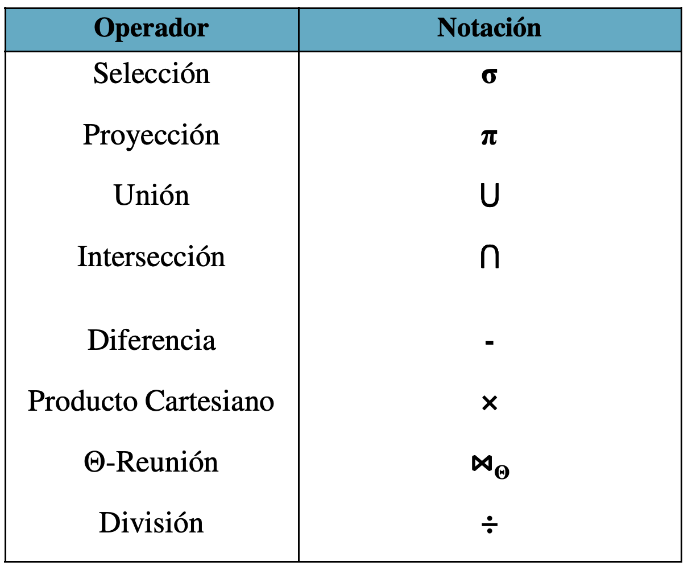
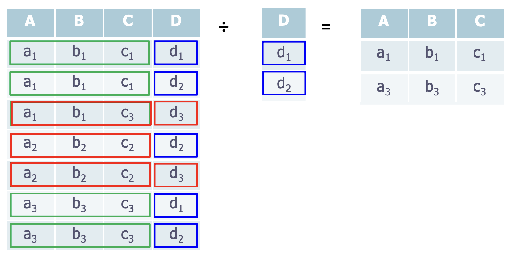

# Anotaciones seminario 4
En este archivo realizaré las anotaciones relativas al seminario 4, 17/04/2023  
Comenzamos con los operadores que se usan, la notación es la mostrada en la tabla
  
### 1. Selección
Este operador se usa con el formato σ(condición)(T), un ejemplo es:  
```
σ(cod_dep='ccia')(profesores)
```
Que equivale a:
```
SELECT * FROM profesores WHERE (cod_dep='ccia');
```

### 2. Proyección
Seleciona las columnas de una tabla que nos interesan, siguiendo el ejemplo anterior: 
```
π nom_prof,catergoria (σ(cod_dep='ccia')(profesores)) 
```
Que equivale a:
```
SELECT nom_prof,cat FROM profesores WHERE cod_dep='ccia'
```
Hay que tener en cuenta que el número de filas que nos devolverá la sentencia en lenguaje algebraico será menor o igual que el original. En el caso de que queramos simular el mismo comportamiento que en algebra (no valores de filas duplicados)
```
SELECT DISTRINCT nomprof,cat FROM profesores WHERE (cod_dep='ccia');
```
--------------------

### Algunos ejercicios de ejemplo  

Obtener una lista con el NRP y el Nombre de aquellos profesores que pertenecen al departamento cuyo código es ELEC:
```
π NRP,nom_prof (σ (cod_dep='ELEC')(profesores))
```
Que equivale a: 
```
SELECT NRP,nombre FROM profesores WHERE (cod_dep='ELEC');
``` 
------------
### 3. Producto Cartesiano
La notación es x, hace todas las combinaciones posibles de los elementos de un conjunto con los elementos de otro conjunto. Es un operador muy costoso ya que su resultado es un incremento de los registros muy superior al original. En el caso de las diapositivas se ha hecho el producto cartesiano de la tabla profesores x departamentos pero debemos de darle sentido a todo esto seleccionando las filas en las que el código del departamento del profesor coincida con el código del departamento, además queremos ver el código del director de Olga Pons. La consulta es:
```
π director (nom_prof='Olga Pons') ^ (departamento.cod_dep=profesores.cod_dep)(profesores x departamento)
```
*el ^ es equivalente a and*

-------------
### 4.Reunión Natural
La notación es ⋈, consigue imponer coherencia entre la eequivalencia de las claves primarias de dos tablas para que haya paridad entre los datos. El criterio que va a utilizar es que los nombres de los atributos a reunir sean los mismos. Un ejemplo de consulta es: 
```
T1 ⋈ T2
```
Y un ejemplo para reunir imparte con profesor:
```
imparte ⋈ profesor
```
Donde emparejaría las dos tablas igualando el dni (en este caso)  
Ejemplo hecho en clase:  
Nombre y correo de los alumnos matriculados en la asignatura FBD en el curso 2023
```
π email,nombre_al(σ(cod_asig='FBD')^(curso_acad='2023')(alumnos ⋈ matricula)) ⋈ asignaturas
```
-------------
### 5.Unión Conjunto Y Diferencia 
La notación de unión es ∪, coge todos los elementos y no repite los repetidos. Para aplicarlos a tablas, ambas deben de ser idénticas salvo el nombre de los atributos, si recordamos una situación parecida en clase nos pasó cuando queríamos volcar la tabla de la profesora en la nuestra y no podíamos porque la suya tenía más columnas. En el caso de que ambas tablas tengan diferentes nombres de columnas toman el nombre de la primera tabla.  Usamos un ejemplo:  
Alumnos matriculados en FBD1 o en FIS  
La notación del conjunto es ∩, y coge los elementos en común de dos tablas. Por ejemplo:  
Alumnos matriculados en FBD1 y FIS
La notación de la diferencia es - . Se usa para realizar el subconjunto de los elementos del primer subconjunto que no están presentes en el segundo subconjunto. Por ejemplo:  
Subconjunto 1 : {1,2,3,4,5,6,7}  
Subconjunto 2 : {5,7,4,9}  
Resultado diferencia: {1,2,3,6}  
Un ejemplo en la vida real serían los Alumnos que están en FIS y no en FBD. ESTE OPERADOR ES ÚTIL CUANDO NO SE REPITEN LOS VALORES DE LAS CLAVES PRIMARIAS

------------
### Ejemplos varios
Ya se pueden hacer los 10 primeros ejercicios de la relación de prado. Comenzamos haciendo algunos ejemplos:  
Encontrar nombre de las asignaturas que no tengan ningún alumno matriculado 
```
π nom_asig ((π cod_asig(asigal) - π cod_asig(σ(curso_acad='2023')(matricula))) ⋈ asignaturas)
```
------------
### 6.Intersección
La notación de la intersección es ∩, coge las tuplas que se repiten en una relación. Para aplicarlos a tablas no es necesario que ambas tablas de la relación sean idénticas. Aplicando un ejemplo de uso: 
Encontrar los alumnos becarios que vienen de Almería.
```
σ beca=SI ∧ provincia=ALMERIA(alumnos)
```
```
σ beca=SI(alumnos) ∩ σ provincia=ALMERIA(alumnos)
```
Una propiedad que podemos tener en cuenta es la siguiente: 
```
R∩S = R − (R − S)
```
--------------
### 7.División 
La notación de la división es ÷, la principal aplicación que tiene son las consultas relacionadas con la conexión de un elemento de un
conjunto con “todos” los elementos de otro. Con esta imagen podemos ver mejor la relación:

  

Algunos ejemplos son:  
Encontrar el nombre y el DNI de los alumnos que están
matriculados de todas las asignaturas de primer curso  
* Divisor:  
```
Π cod_asig(σcurso=1(asignaturas))
```
* Dividendo:
```
π DNI,cod_asig(matriculas)
```
* División = Dividendo ÷ Divisor
```
π DNI,cod_asig(matriculas) ÷ π cod_asig(σcurso=1(asignaturas))
```
Con lo que obtenemos los DNI de los alumnos
matriculados en todas las de primer curso, ahora solo falta
reunir con alumnos para mostrar el resultado solicitado.
```
π alumnos.DNI,alumnos.nom_alum(alumnos ⋈ π DNI,cod_asi (matriculas) ÷ π cod_asig(σcurso=1(asignaturas)))
```